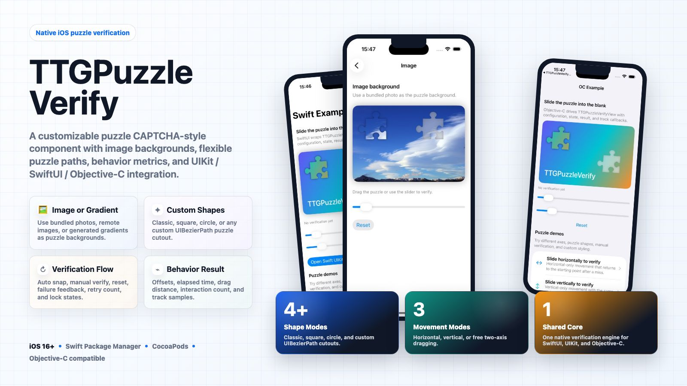
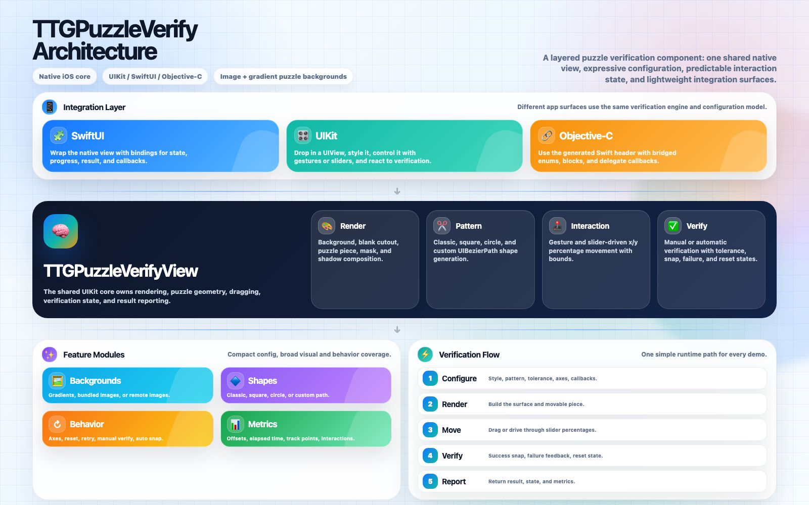
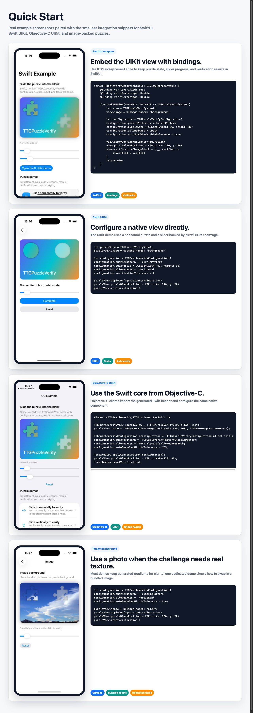

# TTGPuzzleVerify

[](https://travis-ci.org/zekunyan/TTGPuzzleVerify)
[](http://cocoapods.org/pods/TTGPuzzleVerify)
[](http://cocoapods.org/pods/TTGPuzzleVerify)
[](http://cocoapods.org/pods/TTGPuzzleVerify)



TTGPuzzleVerify is a native iOS puzzle verification component. It supports image or gradient puzzle backgrounds, built-in and custom puzzle paths, configurable verification behavior, behavior metrics, and UIKit / SwiftUI / Objective-C integration from one shared core.

## Highlights

* Native UIKit core with SwiftUI and Objective-C interoperability.
* Image, remote image, or generated gradient puzzle backgrounds.
* Classic, square, circle, and custom `UIBezierPath` puzzle shapes.
* Horizontal, vertical, or free two-axis dragging.
* Manual verification or automatic verification with configurable tolerance.
* Success snap, failure feedback, reset, retry, and lock states.
* Rich result payload with offsets, elapsed time, drag distance, interaction count, and optional track samples.
* CocoaPods and Swift Package Manager support for iOS 16+.

## Architecture



The component is organized as one shared `TTGPuzzleVerifyView` core. Integration surfaces configure the same rendering, pattern, interaction, verification, and metrics modules, so SwiftUI, UIKit, and Objective-C demos stay behaviorally consistent.

## Installation

### CocoaPods

```ruby
platform :ios, '16.0'
use_frameworks!

pod "TTGPuzzleVerify"
```

### Swift Package Manager

Add this repository as an iOS 16+ package dependency. The package product is `TTGPuzzleVerify`.

## Quick Start



The editable quick start source lives in `Resources/Marketing/quick_start.html`, built from real screenshots under `Resources/Marketing/assets`.

### SwiftUI wrapper

```swift
import TTGPuzzleVerify

struct PuzzleVerifyRepresentable: UIViewRepresentable {
    @Binding var isVerified: Bool

    func makeUIView(context: Context) -> TTGPuzzleVerifyView {
        let view = TTGPuzzleVerifyView()
        view.image = UIImage(named: "background")

        let configuration = TTGPuzzleVerifyConfiguration()
        configuration.puzzlePattern = .classicPattern
        configuration.puzzleSize = CGSize(width: 86, height: 86)
        configuration.allowedAxes = .both
        configuration.autoSnapWhenWithinTolerance = true

        view.applyConfiguration(configuration)
        view.puzzleBlankPosition = CGPoint(x: 220, y: 96)
        view.verificationChangeBlock = { _, verified in
            isVerified = verified
        }
        return view
    }
}
```

### UIKit configuration

```swift
import TTGPuzzleVerify

let puzzleView = TTGPuzzleVerifyView()
puzzleView.image = UIImage(named: "background")

let configuration = TTGPuzzleVerifyConfiguration()
configuration.puzzlePattern = .circlePattern
configuration.puzzleSize = CGSize(width: 92, height: 92)
configuration.allowedAxes = .horizontal
configuration.verificationTolerance = 7

puzzleView.applyConfiguration(configuration)
puzzleView.puzzleBlankPosition = CGPoint(x: 210, y: 20)
puzzleView.resetVerification()
```

### Objective-C UIKit

```objc
#import <TTGPuzzleVerify/TTGPuzzleVerify-Swift.h>

TTGPuzzleVerifyView *puzzleView = [[TTGPuzzleVerifyView alloc] init];

TTGPuzzleVerifyConfiguration *configuration = [[TTGPuzzleVerifyConfiguration alloc] init];
configuration.puzzlePattern = TTGPuzzleVerifyPatternClassicPattern;
configuration.allowedAxes = TTGPuzzleVerifyAllowedAxesBoth;
configuration.autoSnapWhenWithinTolerance = YES;

[puzzleView applyConfiguration:configuration];
puzzleView.puzzleBlankPosition = CGPointMake(220, 96);
[puzzleView resetVerification];
```

### Image background puzzle

```swift
let configuration = TTGPuzzleVerifyConfiguration()
configuration.puzzlePattern = .classicPattern
configuration.allowedAxes = .horizontal
configuration.autoSnapWhenWithinTolerance = true

puzzleView.image = UIImage(named: "pic3")
puzzleView.applyConfiguration(configuration)
puzzleView.puzzleBlankPosition = CGPoint(x: 200, y: 20)
puzzleView.resetVerification()
```

## Examples

The repository includes two runnable example apps:

* Objective-C UIKit example: run `pod install` from `Examples/ObjCExample`, then open `Examples/ObjCExample/TTGPuzzleVerify.xcworkspace`.
* Swift example with UIKit and SwiftUI demos: run `pod install` from `Examples/SwiftExample`, then open `Examples/SwiftExample/TTGPuzzleVerifySwiftExample.xcworkspace`.

## Key APIs

### Pattern

```swift
public enum TTGPuzzleVerifyPattern: Int {
    case classicPattern
    case squarePattern
    case circlePattern
    case customPattern
}
```

### Drag axes

```swift
public enum TTGPuzzleVerifyAllowedAxes: Int {
    case horizontal
    case vertical
    case both
}
```

### State

```swift
public enum TTGPuzzleVerifyState: Int {
    case idle
    case dragging
    case verified
    case failed
    case locked
}
```

### Result

`TTGPuzzleVerifyResult` includes:

* `isVerified`
* `puzzlePosition`
* `blankPosition`
* `xOffset` / `yOffset`
* `elapsedTime`
* `dragDistance`
* `interactionCount`

### Configuration

Use `TTGPuzzleVerifyConfiguration` to apply behavior consistently:

* `puzzlePattern`
* `puzzleSize`
* `verificationTolerance`
* `allowedAxes`
* `autoSnapWhenWithinTolerance`
* `recordsTrack`
* `maxRetryCount`
* `style`

## Requirements

* iOS 16.0+
* Xcode 15+

## Testing

Objective-C tests cover default configuration, clamping, percentage mapping, verification tolerance, callbacks, configuration/style application, failure locking, result creation, and track collection.

```sh
cd Examples/ObjCExample
pod install
xcodebuild -workspace TTGPuzzleVerify.xcworkspace -scheme TTGPuzzleVerify-Example -destination 'platform=iOS Simulator,name=iPhone 17' test
```

## Marketing Assets

The editable HTML sources live in `Resources/Marketing`:

* `promo_poster.html` -> `promo_poster.jpg`
* `architecture_diagram.html` -> `architecture_diagram.jpg`
* `quick_start.html` -> `quick_start.jpg`

## Author

zekunyan, zekunyan@163.com

## License

TTGPuzzleVerify is available under the MIT license. See the LICENSE file for more info.
